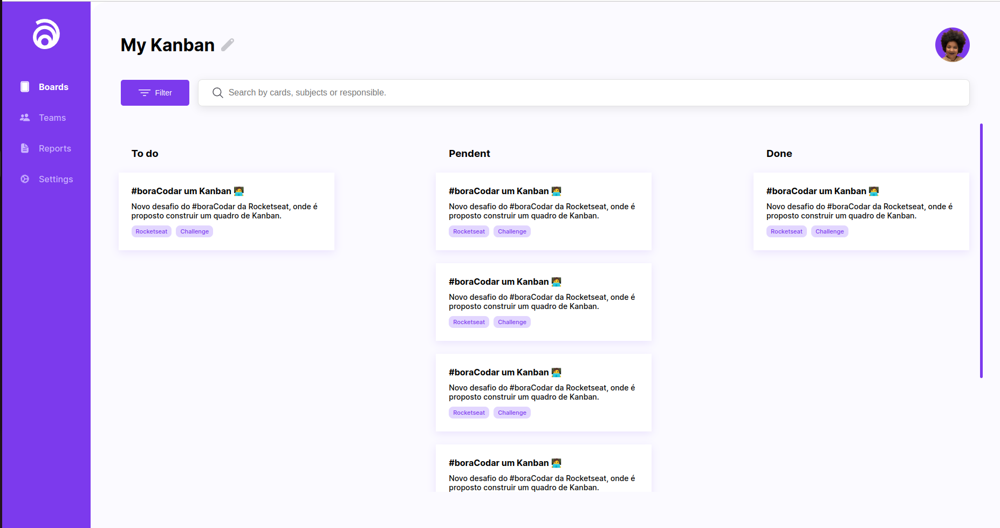

<h1 align="center"> Kanban </h1>

  Desafio do Bora Codar.

  <a href="#tecnologies">Tecnologias</a>&nbsp;&nbsp;&nbsp;|&nbsp;&nbsp;&nbsp;
  <a href="#project">Projeto</a>&nbsp;&nbsp;&nbsp;|&nbsp;&nbsp;&nbsp;
    <a href="#orientations">Orientações</a>&nbsp;&nbsp;&nbsp;|&nbsp;&nbsp;&nbsp;
  <a href="#challenges">Desafios</a>&nbsp;&nbsp;&nbsp;|&nbsp;&nbsp;&nbsp;
  <a href="#extres">Extras</a>&nbsp;&nbsp;&nbsp;|&nbsp;&nbsp;&nbsp;
  <a href="#license">Licença </a>

  

 

  

## 🚀 Tecnologias

 Esse projeto foi desenvolvido com as seguintes tecnologias: 

- HTML, SASS e JavaScript.

## 💻 Projeto

 O Kanban é um projeto/desafio do bora codar da Rockeseat com o objetivo de evoluir as habilidades em programação. Neste desafio eu fui além, mplementei "features" que no desafio não existem, por exemplo: menu mobile e "drag and drop". Foi também neste projeto que comecei a trabalhar com o SASS, até então eu nunca tive a oportunidade de pegar um projeto realizado inicialmente com CSS e refatorá-lo com SASS. 

## 🗺️ Orientações

<ul id="orientations">
  <li> Apenas tenha em seu computador o npm instalado para instalar as depedências e rodar a aplicação com o comando "npm run dev".</li>
</ul>

## ⚔️ Desafios enfrentados

 

## 🧑‍🔧 Extras

 
  Algumas Melhorias que podem ser feitas por eu ou até mesmo por você caso queira no futuro:

  <ul style="margin-left: 20px">
      <li> Criação de API para tarefas dinâmicas; </li>
      <li> Utilizar Typescript. </li>
  </ul>

## Licença

Esse projeto está sob a licença MIT. </a>